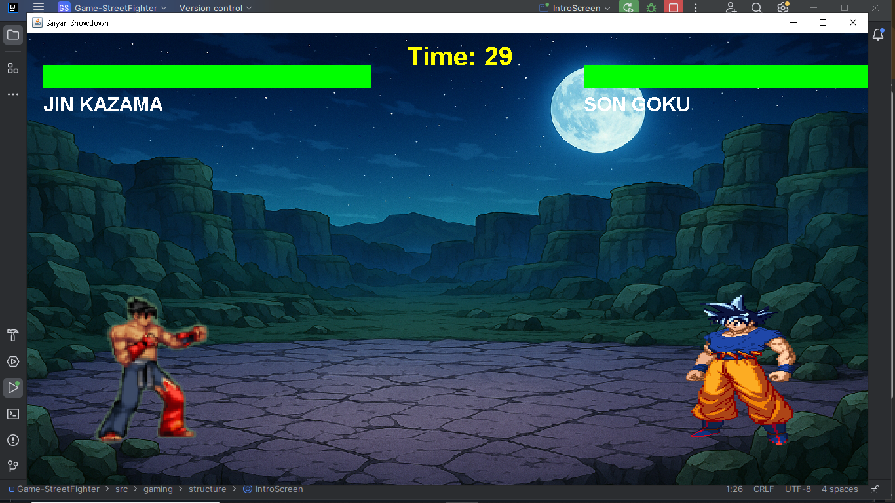

# 🥋 Saiyan Showdown – Goku vs Jin (Java Game)



> ⚔️ A Dragon Ball meets Tekken arcade experience, built in **Java**.

Welcome to **Saiyan Showdown**, a fast-paced 2D arcade-style fighting game where the legendary **Son Goku** faces off against **Jin Kazama**. Inspired by **Dragon Ball Z**, **Street Fighter**, and **Tekken**, this game brings anime intensity into code form — with animations, real-time combat, and background music!

---

## 🎮 Game Preview

👊 Experience a 30-second brawl where you:

- Dodge, punch, kick, jump, and unleash devastating combos  
- Watch your power and health bars drain in real time  
- Enjoy dynamic animations and background audio  
- Reach **Game Over** when a warrior is defeated!

---

## 🛠️ Tech Stack & Features

| Feature           | Technology Used           |
|------------------|---------------------------|
| 🖼️ Graphics       | Java Swing GUI             |
| 🎵 Audio          | JACO MP3 Player Library    |
| 🔄 Game Loop      | `javax.swing.Timer`        |
| 🎞️ Animations     | Custom Sprite Sheets       |
| 🔍 Collision Logic| Bounding Box Detection     |
| ⌨️ Controls       | Java KeyListener API        |
| 🧠 Architecture   | OOP (Classes, Packages)     |

---

## 🕹️ Controls

### 👤 **Player 1 – Jin Kazama**
| Action     | Key     |
|------------|---------|
| Move       | `A` / `D` |
| Jump       | `W`     |
| Kick       | `Z`     |
| Punch      | `C`     |

### 👤 **Player 2 – Son Goku**
| Action     | Key         |
|------------|-------------|
| Move       | `←` / `→`   |
| Jump       | `↑`         |
| Kick       | `SHIFT`     |
| Punch      | `ENTER`     |

---

## 🚀 How to Run

1. Clone the repo  
   ```bash
   git clone https://github.com/YourUsername/Saiyan-Showdown.git
